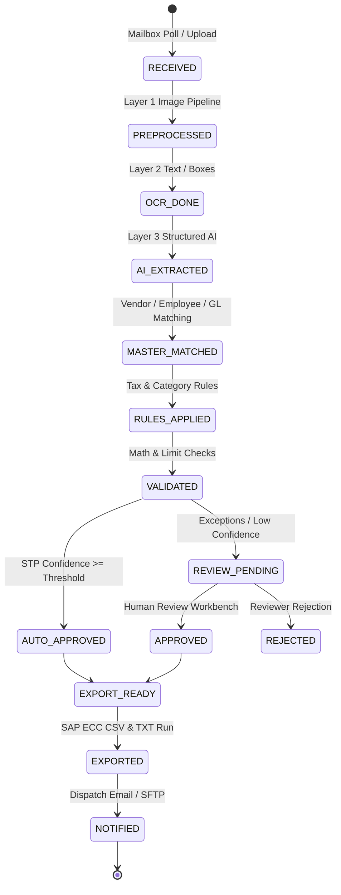

# InvoiceFlow — Enterprise Invoice Ingestion, OCR & SAP ECC Export System

InvoiceFlow is a production-grade, multi-tenant-capable, metadata-driven invoice processing platform built for SAP ECC (FI/CO, MM) enterprise integrations.

## 1. Non-Negotiable Architecture Principles

1. **Zero Hardcoded Values**: Field names, labels, tax determination rules, GL mappings, cost center defaulting, regex patterns, AI prompt templates, error codes, and SAP layout column positions live entirely as database master rows.
2. **Metadata-Driven Runtime**: The UI dynamic form renderer, validation engine, AI JSON schema generator, and SAP export writer consume the same database metadata. Changing a field name in the Admin Panel immediately propagates end-to-end without code changes or restarts.
3. **No Fake / Seed Business Data**: System tables start in clean empty states. Master entities (Vendors, Employees, Cost Centers, GL Accounts) are configured by the admin or loaded through bulk templates.
4. **Structured Error Catalog**: Every single processing step logs to partitioned `process_log` tables with structured error codes (`MAIL-*`, `ATCH-*`, `OCR-*`, `AI-*`, `VAL-*`, `MSTR-*`, `TAX-*`, `EXP-*`, `SYS-*`).
5. **Multi-Layer OCR & AI**:
   - **Layer 0**: Fast native PDF text extraction.
   - **Layer 1**: Configurable OpenCV image pre-processing pipeline.
   - **Layer 2**: Tesseract OCR with word bounding boxes.
   - **Layer 3**: Provider-agnostic AI extraction (Google Gemini, Azure DI, etc.) using versioned prompt templates and strict JSON output schemas.

---

## 2. Processing Pipeline State Machine



---

## 3. Technology Stack

- **Backend**: Python 3.14, FastAPI (async), SQLAlchemy 2.0 (async), Alembic, Pydantic v2.
- **Database**: PostgreSQL 16+ (`pgcrypto`, `pg_trgm`, `uuid-ossp`, `btree_gin`, partitioned tables).
- **Frontend / Admin Panel**: React 18, TypeScript, TailwindCSS v4, Lucide Icons, Motion.
- **AI & OCR**: `@google/genai` (Gemini 2.5 Flash), Tesseract OCR, PyMuPDF.
- **Queue / Storage**: Redis, Celery, Azure Blob / S3 / Local storage.

---

## 4. Quick Start Runbook

### Prerequisites
- Docker & Docker Compose
- Node.js 20+ & npm

### Starting Infrastructure
```bash
# 1. Start PostgreSQL & Redis
docker compose up -d postgres redis

# 2. Initialize Master Database & Structural Bootstrap
make db-init

# 3. Interactively Provision Superadmin (No hard-coded passwords)
python -m app.cli create-admin

# 4. Start the Application
npm run dev
```

Visit `http://localhost:3000` to access the InvoiceFlow Enterprise Admin Console.
