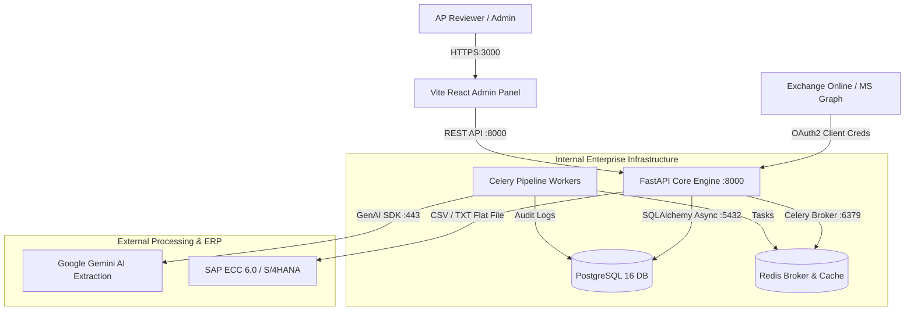
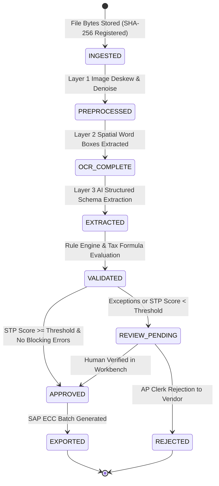

# InvoiceFlow — Solution Architecture & Component Specifications

**Target Audience**: Enterprise Solution Architects, Chief Architects, Technical Directors  

---

## 1. System Context & C4 Container Diagram

---

## 2. Ingestion & Document State Machine

A document transitions through strict state gates. At no point can a document skip a gate or exist without a backing artifact:

---

## 3. Technology Stack Rationale

- **PostgreSQL 16+**: Chosen for native JSONB indexing (allowing arbitrary dynamic field structures without DDL alterations), ACID guarantees, and automated monthly range partitioning for high-volume process logging.
- **FastAPI (Python 3.14)**: Asynchronous non-blocking architecture, native Pydantic v2 data validation, and automated OpenAPI 3.1 specification generation.
- **React 19 + TypeScript**: Type-safe component architecture, zero CSS-framework bloat using Tailwind CSS, and local reactive state persistence.
- **Google GenAI SDK**: Schema-constrained generative extraction providing predictable structured JSON outputs mapped directly to dynamic field definitions.
